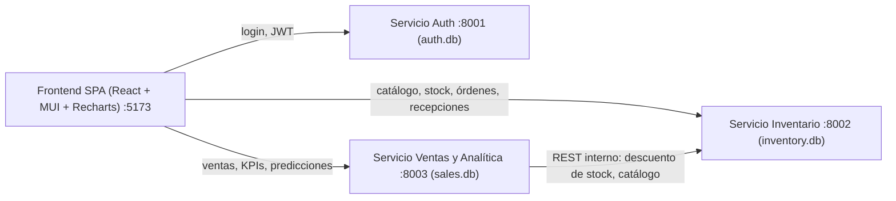
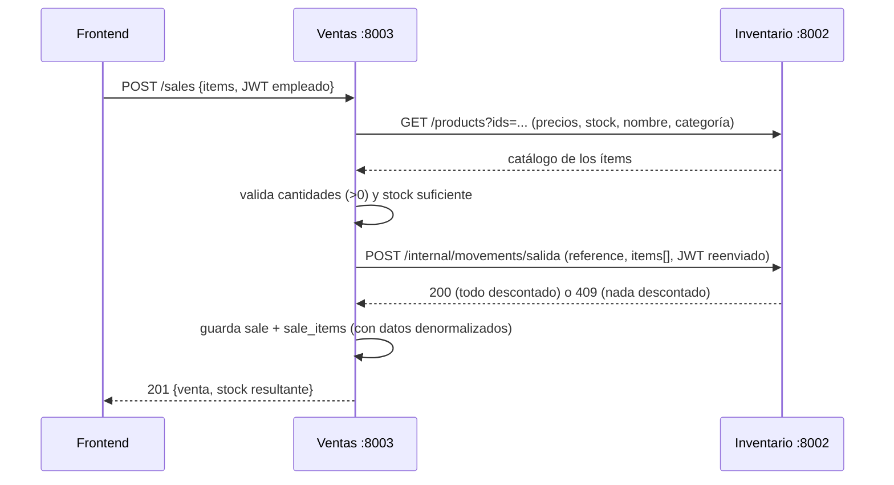

# KeepInventory — Documento de arquitectura

> Fuente de verdad técnica del proyecto. Se mantiene actualizada conforme avanza el roadmap
> (ROADMAP.md). Cubre la FASE DE DISEÑO: arquitectura, componentes, modelo de datos y diseño
> de front y back. Es la base del documento/presentación que se entrega por aparte.

## 1. Visión general

Una tienda de variedad de productos pierde ventas por quiebres de stock y capital por
sobre-stock al no tener visibilidad integrada de ventas, inventario y compras. KeepInventory
es una aplicación web con dashboards por rol que integra: catálogo e inventario en tiempo
real, registro operativo (ventas y recepciones), compras a proveedores, analítica de
tendencias y predicciones de demanda para decidir el reabastecimiento de forma proactiva.

Principios de diseño:
- Arquitectura de microservicios expuestos por API REST (HTTP/JSON).
- Cada microservicio es autónomo: su propio proceso y su propia base de datos SQLite.
- El frontend es una SPA que consume exclusivamente las APIs REST (cero acceso a datos).
- El dueño ve análisis; el empleado ve operación simple (registro de ventas y recepciones).

## 2. Componentes y relaciones

| Componente | Puerto | Responsabilidad | Base de datos |
|---|---|---|---|
| Frontend (SPA) | 5173 | Login, ruteo por rol, dashboards, formularios de operación | ninguna |
| Servicio Auth | 8001 | Usuarios, roles, emisión de JWT | auth.db |
| Servicio Inventario | 8002 | Productos, stock, umbrales, estados, movimientos, proveedores, órdenes de compra, recepciones | inventory.db |
| Servicio Ventas y Analítica | 8003 | Registro de ventas, histórico, KPIs, tendencias, resumen de compras, predicciones | sales.db |

Relaciones:
- Frontend → Auth: solo login y sesión (/auth/me).
- Frontend → Inventario y Ventas/Analítica: todo el dominio, siempre con Bearer JWT.
- Ventas → Inventario (servidor a servidor): al registrar una venta descuenta stock; para
  KPIs y predicciones consulta catálogo/stock. Reenvía el JWT del usuario (mismo RBAC).
- Auth no depende de nadie; Inventario no depende de nadie; Ventas depende de Inventario.

## 3. Comunicación y seguridad

- API REST sobre HTTP/JSON; OpenAPI autogenerado por FastAPI en /docs de cada servicio.
- Autenticación: JWT HS256 firmado por Auth con secreto compartido (JWT_SECRET en .env).
  Claims: sub (id usuario), role (admin|empleado), name, exp (24 h).
- Validación stateless: cada servicio verifica el JWT localmente (sin llamar a Auth).
- Autorización (RBAC) por endpoint: admin = análisis, órdenes, umbrales; empleado =
  registrar ventas, recibir mercancía, catálogo en lectura. Marcado por endpoint en §5.
- CORS habilitado solo para el origen del frontend (http://localhost:5173).

## 4. Modelo de datos por microservicio

Cada servicio posee su BD (SQLite). No hay FK entre servicios: se referencian por
product_id / employee_id.

### 4.1 auth.db — Servicio Auth
- users: id PK | name TEXT | email TEXT UNIQUE | password_hash TEXT (PBKDF2-SHA256 con
  salt aleatorio) | role TEXT CHECK IN ('admin','empleado') | created_at TEXT (ISO-8601)

### 4.2 inventory.db — Servicio Inventario
- suppliers: id PK | name TEXT | contact_email TEXT | lead_time_days INTEGER
- products: id PK | name TEXT | brand TEXT | category TEXT | subcategory TEXT | type TEXT
  | sale_price REAL | market_price REAL | rating REAL | is_active INTEGER (0/1)
  | stock INTEGER DEFAULT 0 | min_threshold INTEGER (umbral de bajo stock)
  | excess_threshold INTEGER (umbral de exceso) | supplier_id FK suppliers | created_at TEXT
- stock_movements: id PK | product_id FK products | movement_type TEXT CHECK IN
  ('entrada','salida') | quantity INTEGER | reason TEXT CHECK IN ('venta','compra','ajuste')
  | reference TEXT (id de venta/orden/nota) | created_at TEXT
- purchase_orders: id PK | supplier_id FK suppliers | status TEXT CHECK IN
  ('borrador','enviada','recibida','cancelada') | expected_date TEXT | created_at TEXT
  | received_at TEXT NULL
- purchase_order_items: id PK | order_id FK purchase_orders (CASCADE) | product_id INTEGER
  | quantity INTEGER | unit_cost REAL

El estado de stock NO se almacena: se calcula en consulta a partir de stock vs umbrales
(§7), por lo que siempre es consistente tras editar umbrales.
Índices: products(category), products(is_active), stock_movements(product_id, created_at),
purchase_orders(status, created_at).

### 4.3 sales.db — Servicio Ventas y Analítica
- sales: id PK | employee_id INTEGER (refiere users en auth.db) | total REAL | created_at TEXT
- sale_items: id PK | sale_id FK sales (CASCADE) | product_id INTEGER (refiere products en
  inventory.db) | product_name TEXT | category TEXT | quantity INTEGER | unit_price REAL
  | line_total REAL

Denormalización deliberada (product_name, category, unit_price copiados en el momento de
la venta): el servicio es autónomo para filtrar/agregar su histórico sin llamar a Inventario
en cada consulta. Es un patrón habitual en microservicios (duplicar datos de lectura para
no acoplar servicios entre sí).

### 4.4 Correspondencia con el dataset BigBasket
products se alimenta del CSV (~28K filas): Product Name→name, Brand→brand,
Sale Price→sale_price, Market Price→market_price, Rating→rating, Category→category,
Sub Category→subcategory, Type→type. Ventas, stock, compras y proveedores no vienen en el
dataset: los simula la semilla (§11) sobre ~2000 "productos activos".

## 5. API REST por servicio

### 5.1 Auth :8001
| Método | Ruta | Rol | Descripción |
|---|---|---|---|
| POST | /auth/login | público | {email, password} → {token, user}; 401 si credenciales inválidas |
| GET | /auth/me | autenticado | datos del usuario según el token |
| GET | /auth/users | admin | lista de usuarios |
| POST | /auth/users | admin | crea usuario (p. ej. empleado) |
| GET | /health | público | chequeo de vida |

### 5.2 Inventario :8002
| Método | Ruta | Rol | Descripción |
|---|---|---|---|
| GET | /health | público | chequeo de vida |
| GET | /products | autenticado | lista paginada; filtros: search (nombre/marca), ids (batch; ignora paginación y devuelve todas las coincidencias), category, subcategory, brand, supplier_id, state (agotado/bajo/disponible/exceso), is_active, page, page_size. Cada ítem incluye su state calculado |
| GET | /products/{id} | autenticado | detalle con state y supplier_name |
| PATCH | /products/{id} | admin | edición parcial: name, sale_price, market_price, is_active |
| PATCH | /products/{id}/threshold | admin | ajusta min_threshold / excess_threshold |
| GET | /categories | autenticado | categorías y subcategorías distintas (para filtros) |
| GET | /suppliers | autenticado | proveedores |
| GET | /alerts | autenticado | productos en estado bajo o agotado |
| GET | /movements | autenticado | histórico de movimientos; filtros: product_id, movement_type, reason, date_from, date_to |
| POST | /movements | empleado, admin | entrada manual o ajuste {product_id, movement_type, quantity>0, reason ∈ {compra, ajuste}, reference?} → actualiza stock; 409 si el stock resultante < 0 |
| POST | /purchase-orders | admin | crea orden borrador {supplier_id, expected_date, items:[{product_id, quantity, unit_cost}]} |
| GET | /purchase-orders | autenticado | lista; filtros: status, supplier_id, date_from, date_to |
| GET | /purchase-orders/{id} | autenticado | detalle con items |
| PATCH | /purchase-orders/{id} | admin | reemplaza items (lista completa) y modifica expected_date (solo si está en borrador) |
| DELETE | /purchase-orders/{id} | admin | elimina la orden (solo si está en borrador) |
| POST | /purchase-orders/{id}/send | admin | borrador → enviada |
| POST | /purchase-orders/{id}/receive | empleado, admin | enviada → recibida: suma stock y crea movimientos entrada |
| POST | /purchase-orders/{id}/cancel | admin | enviada → cancelada (sin efecto en stock) |
| POST | /internal/movements/salida | interno (JWT) | descuenta stock por una venta {reference, items:[...]}: UNA transacción, todo o nada; 409 si algún ítem no alcanza (sin descontar nada) |

### 5.3 Ventas y Analítica :8003
| Método | Ruta | Rol | Descripción |
|---|---|---|---|
| GET | /health | público | chequeo de vida |
| POST | /sales | empleado, admin | registra venta {items:[{product_id, quantity}]}: consulta precios en Inventario, descuenta stock vía REST interno y guarda la venta; 409 si algún producto no tiene stock suficiente |
| GET | /sales | autenticado | histórico paginado; filtros: product_id, category, employee_id, date_from, date_to; ítems embebidos en cada venta |
| GET | /sales/{id} | autenticado | detalle de la venta con sus items |
| GET | /analytics/kpis | admin | total vendido, nº transacciones, ticket promedio (período) + conteos de estado de stock y valor del inventario (consultados a Inventario por REST) |
| GET | /analytics/sales-trend | admin | serie temporal de ventas; group_by=day/week/month; filtros date_from/date_to, category |
| GET | /analytics/sales-by-category | admin | total por categoría en el período |
| GET | /analytics/top-products | admin | top productos por ingreso en el período |
| GET | /analytics/purchases-summary | admin | compras por mes y proveedor (agrega las órdenes de Inventario por REST) |
| GET | /predictions | admin | por producto (paginado, filtro por categoría): demanda diaria estimada, tendencia, fecha estimada de agotamiento, demanda proyectada a 30 días y reorden sugerido |

## 6. Flujos clave

### 6.1 Login y redirección
1. El usuario envía email+contraseña desde /login → Frontend llama POST /auth/login.
2. Auth valida la contraseña (PBKDF2) y firma un JWT con su rol (24 h de validez).
3. El Frontend guarda el token (localStorage) y redirige según el claim role:
   admin → /admin, empleado → /empleado.
4. Cada petición posterior viaja con Authorization: Bearer <token>.

### 6.2 Registrar una venta (empleado)

Si Inventario ya descontó y la escritura local fallara (caso raro), se compensa con
movimientos de entrada (reason=ajuste). El 409 en cualquier ítem no registra nada.

### 6.3 Recibir mercancía (empleado)
1. El Frontend lista órdenes en estado "enviada" (GET /purchase-orders?status=enviada).
2. El empleado confirma la llegada → POST /purchase-orders/{id}/receive.
3. Inventario: enviada → recibida (received_at); por cada ítem: stock += quantity y
   stock_movements(entrada, reason=compra, reference=orden).

### 6.4 Reabastecimiento guiado por predicción (dueño)
1. El dueño abre Predicciones → Frontend llama GET /predictions (Ventas :8003).
2. Ventas lee ventas de sales.db, consulta stock y umbrales a Inventario (REST) y aplica
   el modelo (§8).
3. El dueño ve fecha estimada de agotamiento y reorden sugerido por producto.
4. Botón "Crear orden de compra" → Frontend arma el borrador y lo envía a Inventario
   (POST /purchase-orders) con la cantidad sugerida; luego lo revisa/modifica y lo envía.

## 7. Estados de stock (semáforo)

Calculados en consulta (no se almacenan → siempre consistentes con los umbrales):
- Agotado: stock = 0 (rojo #EF4444)
- Bajo: 0 < stock ≤ min_threshold (ámbar #F59E0B)
- Disponible: min_threshold < stock < excess_threshold (verde #10B981)
- Exceso: stock ≥ excess_threshold (azul #3B82F6)

## 8. Modelo de predicción

Input: serie diaria de unidades vendidas por producto (últimos 120 días, sales.db).
- Si el producto tiene ≥ 10 días con ventas: regresión lineal (sklearn LinearRegression)
  y = m·d + b sobre el índice de día → demanda_diaria = media de la proyección de los
  próximos 30 días (mínimo 0); tendencia = signo de m con banda muerta de ±5%.
- Si no (baja rotación): media móvil simple de 30 días.

Salidas por producto:
- fecha_agotamiento = hoy + stock / demanda_diaria (solo si demanda > 0).
- demanda_30d = demanda_diaria × 30 (proyección).
- reorden_sugerido = max(0, redondear(demanda_30d + min_threshold − stock)).

Coste: se calcula por página de 50 productos y se cachea en memoria 10 min → <2 s.
Limitaciones (transparencia para la sustentación): modelo univariado (no usa precio ni
estacionalidad anual), entrenado con 180 días de historial simulado.

## 9. Diseño del frontend

SPA React (TypeScript) con react-router. Dos experiencias por rol tras el login:
- /empleado (pestañas): Registrar venta | Recibir mercancía | Catálogo. Sin gráficas.
- /admin (pestañas): Resumen | Inventario (semáforo) | Predicciones | Órdenes de compra
  | Ventas (histórico). Filtros dinámicos en cada vista (rango de fechas, categoría,
  subcategoría, proveedor, estado de stock, producto).

Componentes: MUI (AppBar/Tabs/Cards/Dialogs) + DataGrid (tablas interactivas: orden,
filtro y paginación) + Recharts (área con degradado para tendencias, barras redondeadas
para comparativas).

Estilo Lightdash: fondo #F7F8FA, tarjetas blancas (radio 14, borde #E5E7EB), tipografía
Inter, KPI = número grande + etiqueta + chip de variación, paleta de gráficas
[#7C3AED, #14B8A6, #F59E0B, #EC4899, #3B82F6, #8B5CF6].

## 10. Requisitos no funcionales

- Navegador estándar (SPA); dashboard pensado para desktop.
- <2 s por consulta: SQLite local, agregaciones con GROUP BY en SQL, paginación
  server-side (50 por página), predicciones paginadas y cacheadas.
- Separación estricta de responsabilidades: el frontend solo habla REST; cada servicio
  esconde su base de datos.
- Demo local con start-all.ps1 (4 procesos). En producción: contenedores separados por
  servicio y PostgreSQL (migración directa: mismo esquema vía SQLAlchemy).

## 11. Semilla de datos (scripts/seed.py)

1. Lee data/*.csv (BigBasket) → catálogo completo en inventory.db.
2. Marca ~2000 productos activos con: demanda base por categoría, estacionalidad
   semanal (fin de semana) y ligera tendencia.
3. Usuarios demo: admin@tienda.com/admin123 y empleado@tienda.com/empleado123 (+1
   vendedor adicional).
4. 10 proveedores; ~40 órdenes de compra a lo largo de 180 días (mayoría recibidas).
5. ~180 días de tickets de venta (15–40 por día, 1–5 líneas c/u) en sales.db.
6. Ajusta stock/umbrales para exponer los 4 estados: ~5% agotado, ~15% bajo, ~10% exceso.
